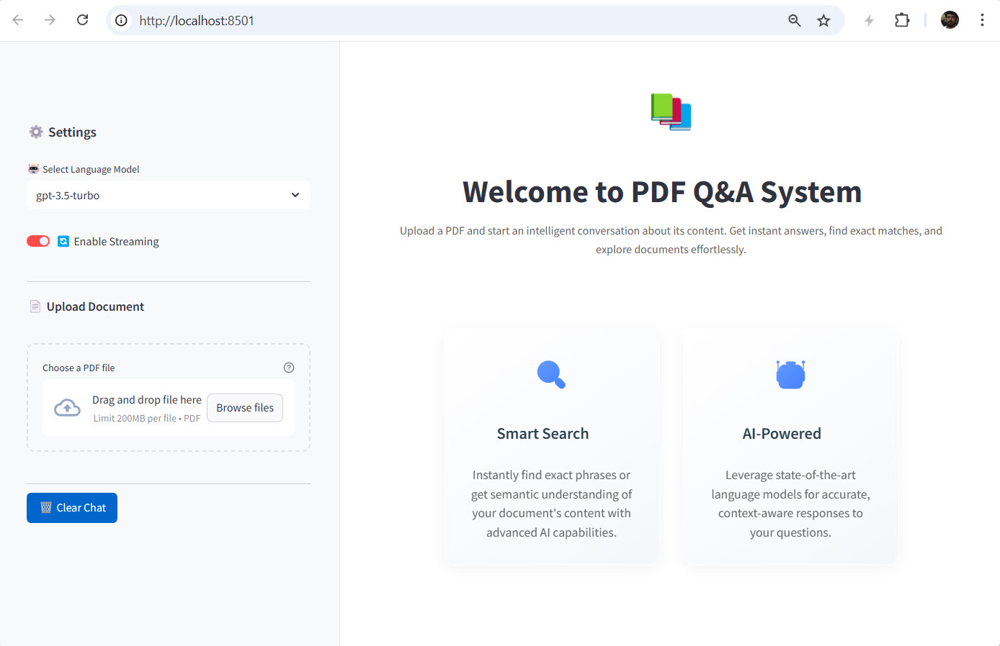
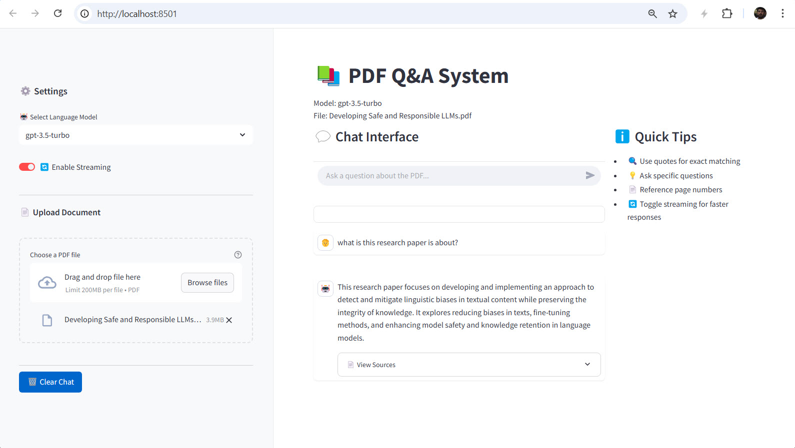

# PDF Q&A Application with LangChain

A powerful PDF Question-Answering application built with Streamlit and LangChain that allows users to upload PDF documents and ask questions about their content. The application uses advanced language models and vector embeddings to provide accurate and contextual answers.

## Features

- 📄 PDF Document Upload and Processing
- 🔍 Intelligent Question Answering
- 💡 Context-Aware Responses
- 🎯 Multiple Answer Types (Exact Match and Semantic Search)
- 🎨 Modern and User-Friendly Interface
- 🔄 Real-time Processing and Response

---

## Streamlit App Preview - Main Page

<p align="center">
  
</p>

---

## Streamlit App Preview - Chat Interface Page

<p align="center">
  
</p>

---

## Prerequisites

- Python 3.8 or higher
- OpenAI API key (for using OpenAI models)
- Ollama (optional, for local model support)

## Installation

1. Clone the repository:
```bash
git clone https://github.com/yourusername/pdf-qa-app-with-langchain.git
cd pdf-qa-app-with-langchain
```

2. Create and activate a virtual environment:
```bash
# Windows
python -m venv .venv
.venv\Scripts\activate

# Linux/MacOS
python -m venv .venv
source .venv/bin/activate
```

3. Install the required dependencies:
```bash
pip install -r requirements.txt
```

4. Set up environment variables:
   - Copy `env.example` to `.env`
   - Add your OpenAI API key:
```
OPENAI_API_KEY=your_api_key_here
```

## Running the Application

1. Start the application:
```bash
python run.py
```

2. Open your web browser and navigate to:
```
http://localhost:8501
```

## Usage

1. Upload a PDF document using the file uploader in the sidebar
2. Wait for the document to be processed
3. Type your question in the chat input
4. View the AI's response in the chat interface

## Project Structure

```
pdf-qa-app-with-langchain/
├── app/
│   ├── core/           # Core functionality
│   ├── components/     # UI components
│   ├── tools/          # Custom tools
│   └── main.py         # Main application
├── requirements.txt    # Project dependencies
├── run.py             # Application launcher
└── README.md          # This file
```

## Dependencies

- Streamlit: Web application framework
- LangChain: Framework for LLM applications
- FAISS: Vector similarity search
- PyPDF: PDF processing
- OpenAI: Language model integration
- Other dependencies listed in requirements.txt

## Contributing

Contributions are welcome! Please feel free to submit a Pull Request.

## License

This project is licensed under the MIT License - see the LICENSE file for details.

## Support

If you encounter any issues or have questions, please open an issue in the GitHub repository.
